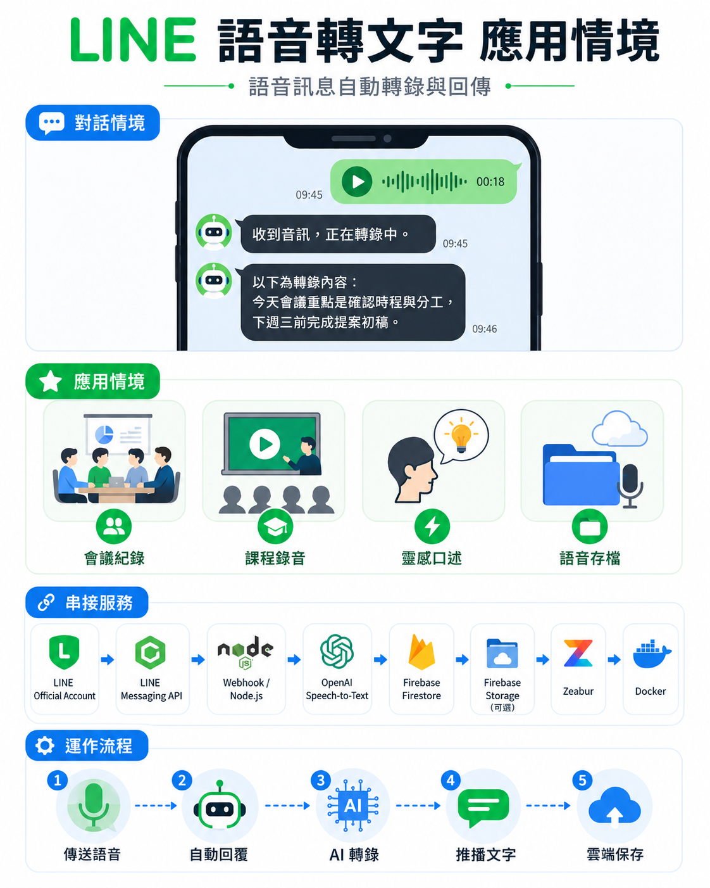

# LINE Audio Transcript Webhook

Node.js + TypeScript service for Zeabur. It receives LINE Official Account webhooks, validates the LINE signature with the raw request body, handles audio messages, downloads LINE audio content, transcribes it with OpenAI Speech-to-Text, stores transcript jobs in Firebase Firestore, optionally saves audio to Firebase Storage, and sends the transcript back to the LINE user.

## 中文說明

這是一個可部署到 Zeabur 的 LINE 語音轉文字 Webhook 服務。使用者在 LINE 官方帳號傳送語音訊息後，服務會下載音訊、呼叫 OpenAI Speech-to-Text 轉成文字、把處理紀錄寫入 Firebase Firestore，最後將轉錄結果回傳給 LINE 使用者。

### 架構與流程圖




### 功能

- 接收 LINE Official Account Webhook 事件。
- 使用 LINE 簽章驗證請求，避免未授權來源呼叫 Webhook。
- 只處理 LINE 音訊訊息，非音訊事件會略過。
- 從 LINE Messaging API 下載使用者傳來的音訊內容。
- 使用 OpenAI Speech-to-Text 模型進行語音轉文字。
- 將轉錄工作狀態寫入 Firebase Firestore，包含 `processing`、`completed`、`failed`。
- 支援兩階段回覆模式：先回覆「收到音訊，正在轉錄中。」，完成後再推播轉錄結果。
- 支援單次回覆模式，方便本機測試或短音訊同步處理。
- 可選擇將原始音訊保存到 Firebase Storage。
- 提供 `/health` 健康檢查端點，方便部署平台偵測服務狀態。

### 使用的平台服務

- LINE Official Account / LINE Developers：接收使用者語音訊息與設定 Webhook。
- LINE Messaging API：下載音訊內容、回覆訊息與推播轉錄結果。
- OpenAI API：使用 Speech-to-Text 進行音訊轉文字。
- Firebase Firestore：儲存每次轉錄工作的狀態與結果。
- Firebase Storage：可選，用於保存原始音訊檔。
- Zeabur：建議的雲端部署平台，搭配本專案的 Dockerfile 使用。
- Docker：用於容器化部署。
- Node.js 20+：本機開發、測試與執行服務。

## Endpoints

- `GET /health` returns `{ "ok": true }`
- `POST /webhook` receives LINE webhook events

## Default Behavior

`LINE_REPLY_MODE=two_step` is the default:

1. Reply immediately with `收到音訊，正在轉錄中。`
2. Process the audio in the background
3. Push the transcript to the LINE user when complete

Set `LINE_REPLY_MODE=single_reply` only for testing or short synchronous processing. In that mode the service waits for transcription and uses the LINE reply token for the final transcript.

## Firestore

Transcript jobs are stored in the `transcriptJobs` collection.

Typical fields:

- `eventId`
- `messageId`
- `userId`
- `sourceType`
- `status`: `processing`, `completed`, or `failed`
- `transcript`
- `errorMessage`
- `audioStoragePath`
- `createdAt`
- `updatedAt`
- `completedAt`
- `failedAt`

If transcription fails, the service updates the job with `status = failed`.

## Environment Variables

Copy `.env.example` to `.env` for local development.

Required:

- `LINE_CHANNEL_SECRET`
- `LINE_CHANNEL_ACCESS_TOKEN`
- `OPENAI_API_KEY`
- Firebase credentials using either:
  - `FIREBASE_SERVICE_ACCOUNT_BASE64`
  - `GOOGLE_APPLICATION_CREDENTIALS`

Optional:

- `PORT`, defaults to `3000`
- `LINE_REPLY_MODE`, defaults to `two_step`
- `OPENAI_TRANSCRIPTION_MODEL`, defaults to `gpt-4o-mini-transcribe`
- `STORE_AUDIO`, defaults to `false`
- `FIREBASE_STORAGE_BUCKET`, required only when `STORE_AUDIO=true`

## Local Development

```bash
npm install
npm run dev
```

Run tests:

```bash
npm test
```

Build:

```bash
npm run build
```

Start compiled server:

```bash
npm start
```

## Zeabur Deployment

Use the included `Dockerfile`.

Set the same environment variables in Zeabur. Zeabur provides `PORT`; the server reads it automatically.

For Firebase on Zeabur, base64 encode the service account JSON and set it as `FIREBASE_SERVICE_ACCOUNT_BASE64`.

Example:

```bash
base64 -w 0 service-account.json
```

On Windows PowerShell:

```powershell
[Convert]::ToBase64String([IO.File]::ReadAllBytes("service-account.json"))
```

## LINE Webhook Setup

Set the LINE Official Account webhook URL to:

```text
https://YOUR-ZEABUR-DOMAIN/webhook
```

Enable webhook events in the LINE Developers Console.

## 使用畫面


